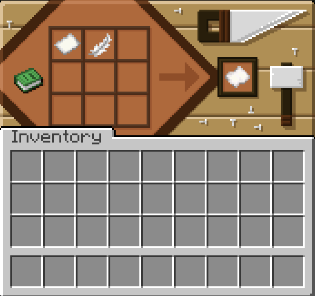
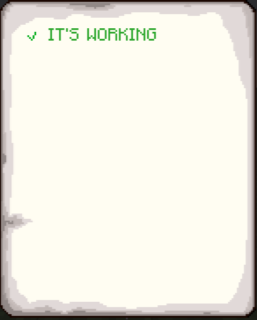

# Contracts

> A lightweight Fabric mod for Minecraft 1.20.1 that introduces **Contracts** — an advanced upgrade to vanilla Book and Quill with enhanced text editing, interactive elements, and document formatting.

---

> ⚠️ **Project Status: Early Development**
> Currently, only core object initializations are complete. All features listed below are actively **IN DEVELOPMENT** (WIP) and subject to change.

---

## 🌟 Planned Features

* 🛠️ **[     DONE     ] Interactive Checkboxes** — Create toggleable checklist items directly inside documents.
* 📝 **[ PARTLY DONE ] Dynamic Lists** — Bullet points, numbered lists, and auto-indenting text blocks.
* 🎨 **[IN DEVELOPMENT] Rich Text Formatting** — Advanced styling tools including colors, bold/italic/strikethrough toggles, and alignment options.
* 📜 **[     DONE     ] Contract Signing & Binding** — Formalize agreements between players with immutable signatures.
* ⚡ **[IN DEVELOPMENT] Lightweight & Vanilla-Friendly** — Minimal overhead, seamless integration into standard gameplay without bloat.

---

## 🛠️ Status & Progress

| Feature / Component                      |      Status      |
| :--------------------------------------- | :---------------: |
| Mod Setup & Object Initialization        |      ✅ Done      |
| Item & GUI Registration                  |      ✅ Done      |
| Custom Book/Contract Screen UI           |      ✅ Done      |
| Checkboxes & Interactive Text Components |  ✅ Partly Done  |
| Text Formatting & Parsing Engine         | 🚧 In Development |
| NBT Saving & Network Serialization       |      ✅ Done      |

---

## 🔧 Requirements & Installation

1. Download and install **Minecraft 1.20.1**.
2. Install **Fabric Loader** (v0.19.3+).
3. Download and place **Fabric API** (any version) into your `.minecraft/mods` folder.
4. Download and place **Fabric Language Kotlin** (any version) into your `.minecraft/mods` folder.
5. Download the latest release of **Contracts** and place it in your `mods` folder.

---

## 📚 Guide

> ⚠️ This section will be updated as development progresses. Stay tuned

To get the contract paper you should craft it via a paper and a feather.

After crafting the contract right click it and open gui. To create a line with checkbox press enter.

---

## 🤝 Contributing & Support

As this project is in active early development, feedback, suggestions, and contributions are welcome!

* **Issues / Feature Requests:** Please open an issue on GitHub.
* **Pull Requests:** Feel free to submit PRs for features marked as *In Development*.

---

## 📄 License

This mod is licensed under the [MIT License](LICENSE).
